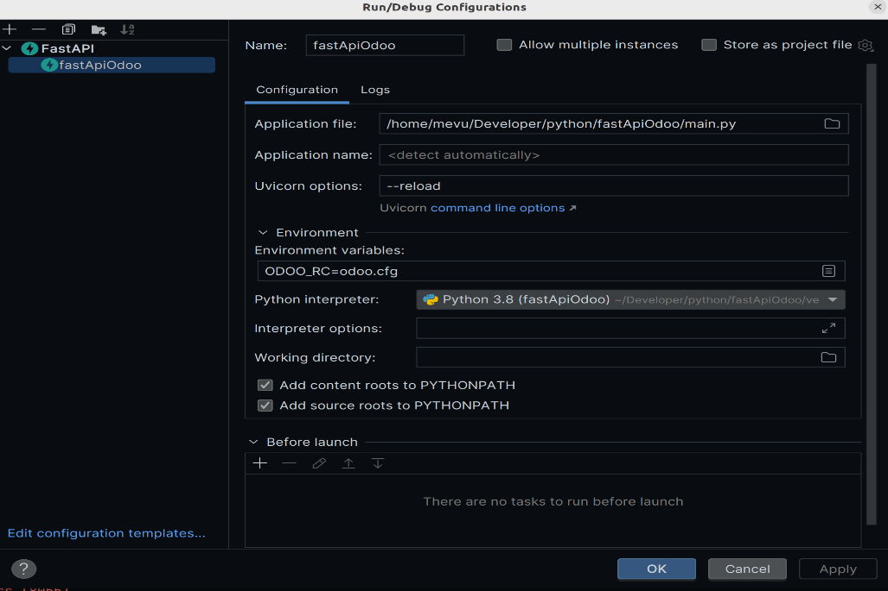
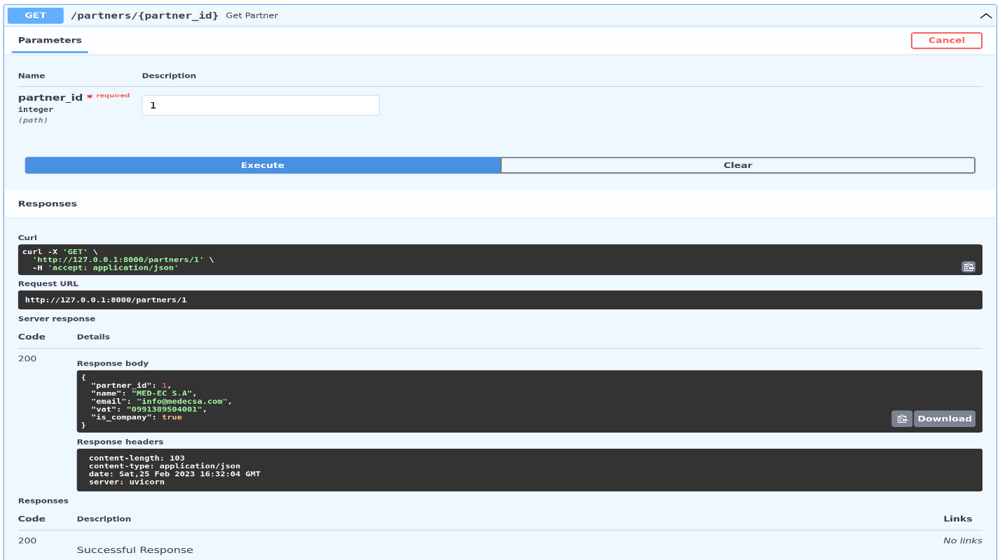

# FastAPI with Odoo backend

## Autor

- [@mangrovex](https://www.github.com/mangrovex)

Para instalar, primero cree un entorno virtual de python e instale las dependencias en él:

```console
$ python3 -m venv .venv
$ .venv/bin/python3 -m pip install requirements.txt
```

Luego cree un archivo de configuración `odoo.cfg` con `db_name`:

```ini
db_name = promedec
```

Inicialice una base de datos normal de Odoo, con el modulo `Contacts`

A continuación, puede ejecutar el servidor de aplicaciones de demostración utilizando:

```console
$ env ODOO_RC=odoo.cfg .venv/bin/python3 -m uvicorn main:app
```

Y, por último, puede examinar la documentación de OpenAPI en `http://127.0.0.1:8000/docs` y probar los extremos de la API
con los botones `Try it out`

## Demo

Configuracion



Prueba

